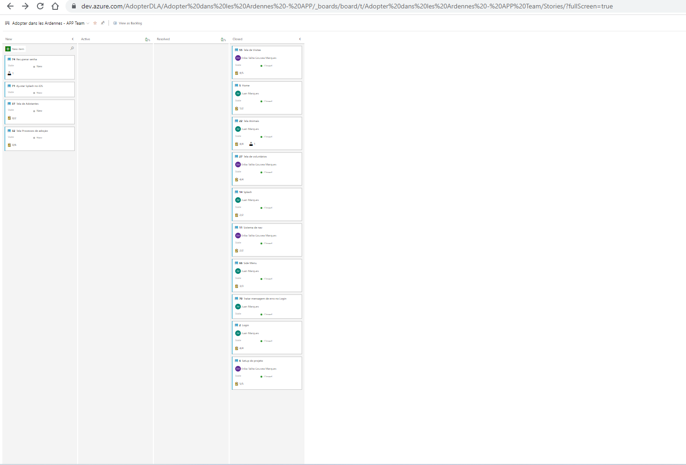

# Aplicativo 'Adopter Dans Les Ardennes': Quadro de Gestão e Contribuições do Time

## Quadro Visual Atual de Gestão de Trabalho

Utilizamos o Azure DevOps para gerenciar nosso trabalho. Você pode acessar nosso quadro de trabalho [aqui](https://dev.azure.com/AdopterDLA/Adopter%20dans%20les%20Ardennes%20-%20APP/_boards/board/t/Adopter%20dans%20les%20Ardennes%20-%20APP%20Team/Stories/?fullScreen=true).

## Status Atual das Contribuições dos Membros do Time

Os membros ativos de nossa equipe são:

- Erika Talita Gouvea Marques
- Juan Marques

## Lista de Commits
Você pode conferir a lista de commits realizados em nosso repositório GitHub [aqui](https://github.com/1ErikaMarques/adopter-dans-les-ardennes-app/commits/main) Os commits representam as alterações e contribuições feitas ao longo do desenvolvimento do projeto.

## Resumo dos Commits
Aqui está um resumo dos commits realizados em nosso repositório:

- Commit 1: Implementação inicial do projeto.
- Commit 2: Configuração inicial e implementação.
- Commit 3: Remover Husky.
- Commit 4: Adicionar fontes.
- Commit 5: Adicionar tema.
- Commit 6: Merge de commits anteriores.
- Commit 7: Adicionar tela de registro de animais.
- Commit 8: Implementação da tela de login, hook de autenticação e splash.
- Commit 9: Ajustes na implementação de autenticação.
- Commit 10: Ajustes no interceptor.
- Commit 11: Tela de registro de animais.
- Commit 12: Implementação da lista de animais.
- Commit 13: Implementação do SideMenu e tela de autenticação.
- Commit 14: Ajustes nos animais.
- Commit 15: Ajustes na tela de voluntários.
- Commit 16: Habilitar atualização de animais e triagem de voluntários.
- Commit 17: Nova implementação de animais.
- Commit 18: Trabalho em progresso.
- Commit 19: Refatoração e adição do seletor de imagens.
- Commit 20: Implementação da lista/formulário de voluntários.
- Commit 21: Ajuste na API.
- Commit 22: Refatoração final.
- Commit 23: Merge de commits anteriores.
- Commit 24: Fix para verificar a existência de um ID.
- Commit 25: Merge de commits anteriores.
- Commit 26: Outro commit sem mensagem específica.
- Commit 27: Fix para verificar a existência de um ID.

## Comentários Adicionais sobre as Participações Individuais

Durante o desenvolvimento do projeto, Erika e Juan têm demonstrado um alto nível de comprometimento e dedicação. Ambos têm proficiência em tecnologias como Expo, TypeScript e React Native, entregando funcionalidades de alta qualidade e garantindo a estabilidade do aplicativo.

Erika se destaca por sua habilidade em design de interface, trazendo uma estética visualmente agradável para o aplicativo. Além disso, ela também se destaca em programação, contribuindo com soluções criativas e eficientes para os desafios técnicos do projeto.

Juan tem se destacado em desenvolvimento e programação, utilizando suas habilidades em Expo, TypeScript e React Native. Ele entrega funcionalidades completas e bem estruturadas, contribuindo para a qualidade geral do aplicativo.

Ambos os membros são essenciais para o sucesso do projeto e estão comprometidos em entregar um aplicativo de adoção de animais eficiente e completo.